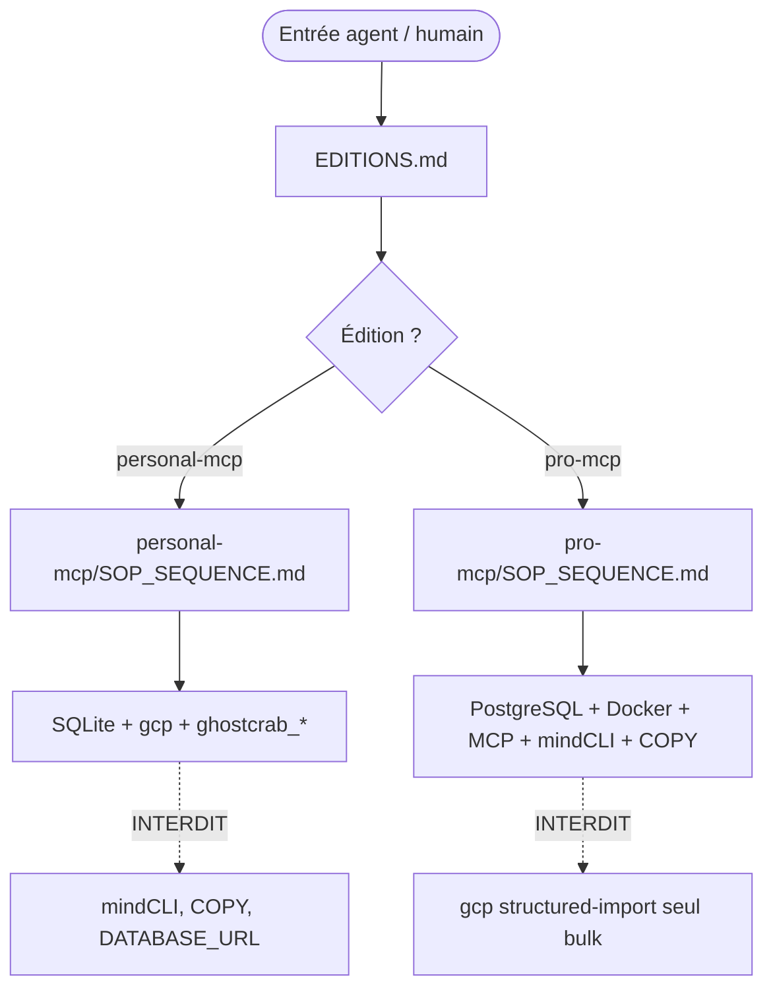
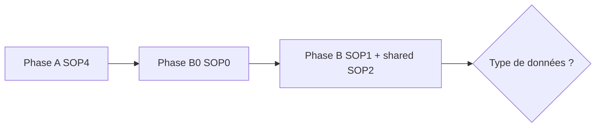
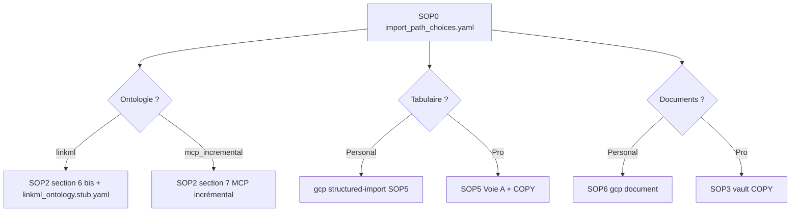
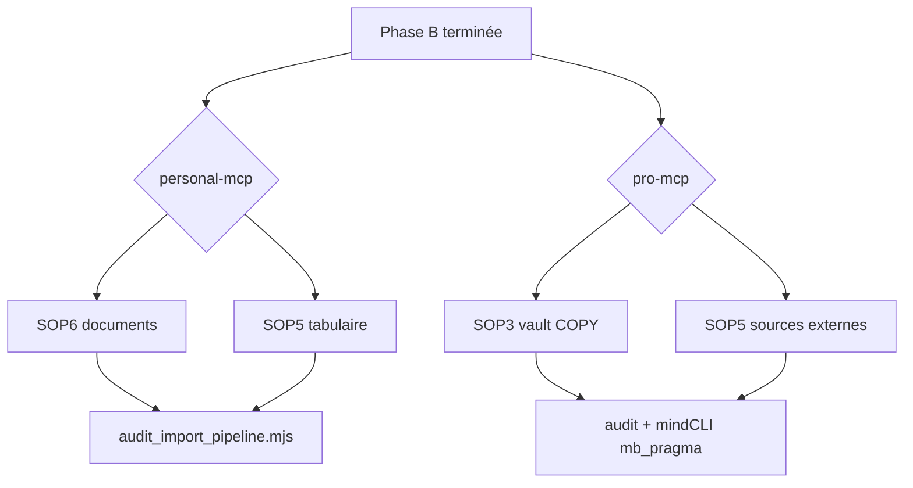

# Plan de routes — StarterKit GhostCrab (SOP 0→6)

## Principe directeur

**Une seule édition par parcours.** Les fichiers racine [`starterkit/SOP*.md`](starterkit/SOP0_import_path_choices.md) sont des **stubs de redirection** — ne jamais les utiliser comme checklist. La route canonique passe par :

1. [`starterkit/EDITIONS.md`](starterkit/EDITIONS.md) — choix d'édition
2. [`starterkit/QUICKSTART.md`](starterkit/QUICKSTART.md) — routeur (pas une checklist mixte)
3. **Une** séquence exclusive :
   - [`starterkit/personal-mcp/SOP_SEQUENCE.md`](starterkit/personal-mcp/SOP_SEQUENCE.md)
   - [`starterkit/pro-mcp/SOP_SEQUENCE.md`](starterkit/pro-mcp/SOP_SEQUENCE.md)



---

## Matrice édition (décision initiale)

| Critère | **personal-mcp** | **pro-mcp** |
|---------|-------------------|-------------|
| Repo produit | `ghostcrab-personal-mcp` | `ghostcrab-mcp` |
| Base | SQLite (`~/.ghostcrab/...` ou `GHOSTCRAB_SQLITE_PATH`) | PostgreSQL 17 + Docker + `DATABASE_URL` |
| Démarrage | `gcp smoke`, `gcp brain up` | `make dev-bootstrap`, `npm run smoke:mcp` |
| Ontologie formelle | `gcp brain ontology compile` | LinkML + SQL / DDL MCP |
| Vault Obsidian (docs) | [`SOP6`](starterkit/personal-mcp/SOP6_gcp_document_import.md) — `gcp brain document` | [`SOP3`](starterkit/pro-mcp/SOP3_parsing_pipeline.md) — parsing → COPY |
| Tabulaire (CSV/API) | [`SOP5 structured-import`](starterkit/personal-mcp/SOP5_structured_import.md) | [`SOP5 compiler + COPY`](starterkit/pro-mcp/SOP5_source_import_compiler.md) |
| Audit projections | MCP `ghostcrab_pack` | mindCLI `mb_pragma` + MCP |

**Règle absolue :** ne jamais mélanger `gcp brain structured-import` (Personal) avec COPY/mindCLI (Pro) sur la même base.

---

## Route commune — phases obligatoires

Les deux éditions partagent le **squelette de phases** ; seuls les opérateurs et SOP d'import diffèrent.



| Phase | Rôle | SOP | Critère « done » |
|-------|------|-----|------------------|
| **A** | Environnement opérationnel | SOP4 (édition-specific) | `ghostcrab_status` OK, outils MCP visibles |
| **B0** | Enregistrer les choix de voie | SOP0 + [`templates/import_path_choices.yaml`](starterkit/templates/import_path_choices.yaml) | YAML rempli avec `edition:` correct |
| **B** | Modéliser le workspace | SOP1 + [`shared/SOP2`](starterkit/shared/SOP2_obsidian_ontologie.md) | Schémas/ontologie prêts, baseline `ghostcrab_coverage` |

### Phase A — bootstrap

**Personal** — [`personal-mcp/SOP4_environment_bootstrap.md`](starterkit/personal-mcp/SOP4_environment_bootstrap.md)

- Installer `@mindflight/ghostcrab-personal-mcp@0.5.0`, `gcp authorize`
- Optionnel : `export GHOSTCRAB_SQLITE_PATH=...`
- Valider : `gcp smoke` → `gcp brain up` → `ghostcrab_status`
- **Pas requis :** Docker, PostgreSQL, mindCLI

**Pro** — [`pro-mcp/SOP4_environment_bootstrap.md`](starterkit/pro-mcp/SOP4_environment_bootstrap.md)

- Cloner `ghostcrab-mcp`, submodules, `.env`, Docker Postgres
- `make dev-bootstrap`, migrations, `npm run smoke:mcp`
- Valider : `ghostcrab_status` acceptable

### Phase B0 — bifurcations enregistrées (SOP0)

Remplir [`templates/import_path_choices.yaml`](starterkit/templates/import_path_choices.yaml) **avant** toute modélisation lourde.

**Personal defaults** ([`personal-mcp/SOP0`](starterkit/personal-mcp/SOP0_import_path_choices.md)) :

```yaml
edition: personal-mcp
ontology_path: linkml          # ou mcp_incremental
tabular_path: gcp_structured_import
document_path: gcp_document
```

**Pro defaults** ([`pro-mcp/SOP0`](starterkit/pro-mcp/SOP0_import_path_choices.md)) :

```yaml
edition: pro-mcp
ontology_path: linkml_or_sql
tabular_path: sop5_voie_a_copy
document_path: sop3_copy
projection_audit: mindcli
```



### Phase B — modélisation (SOP1 + SOP2 partagé)

**Artefacts à produire en premier** (Annexe A de SOP2, ordre strict) :

1. [`templates/jtbd.yaml`](starterkit/templates/jtbd.yaml)
2. [`templates/mvp_core_contract.yaml`](starterkit/templates/mvp_core_contract.yaml)
3. [`templates/ontology_core_provisioning.yaml`](starterkit/templates/ontology_core_provisioning.yaml)
4. [`templates/initial_referential.yaml`](starterkit/templates/initial_referential.yaml)
5. [`templates/mapping_external_to_canonical.yaml`](starterkit/templates/mapping_external_to_canonical.yaml)
6. [`templates/disambiguation.yaml`](starterkit/templates/disambiguation.yaml)

**Personal SOP1** — [`personal-mcp/SOP1_ghostcrab_mcp.md`](starterkit/personal-mcp/SOP1_ghostcrab_mcp.md)

1. `ghostcrab_status` → `ghostcrab_modeling_guidance`
2. `ghostcrab_workspace_create`
3. `ghostcrab_schema_register` (formes `ghostcrab:*`, pas OWL LinkML)
4. `ghostcrab_workspace_inspect`, `ghostcrab_coverage`
5. LinkML : SOP2 §6 bis + `gcp brain ontology compile` (dry-run puis `--import-db`)

**Pro SOP1** — [`pro-mcp/SOP1_ghostcrab_mcp.md`](starterkit/pro-mcp/SOP1_ghostcrab_mcp.md)

- MCP = modélisation + requête ; **bulk = SQL/COPY jamais MCP**
- Cycle DDL : `ghostcrab_ddl_propose` → approbation humaine → `ghostcrab_ddl_execute`
- Layer 1 (tables typées) ↔ Layer 2 (`mfo_facets`) via triggers sync

**SOP2 partagé** — [`shared/SOP2_obsidian_ontologie.md`](starterkit/shared/SOP2_obsidian_ontologie.md)

- Analyse JTBD vault → ontologies candidates
- JSONB intermédiaire (section 4.3) + validation avant injection
- **Gate modeling :** Model Proposal + confirmation utilisateur avant writes massifs

---

## Routes d'import — après Phase B

Les phases C et C2 sont **optionnelles** et peuvent être menées en parallèle une fois B terminée (Personal) ; Pro enchaîne souvent B → C (vault) puis C2 (sources externes).



### Route Personal — documents (Phase C)

**SOP :** [`personal-mcp/SOP6_gcp_document_import.md`](starterkit/personal-mcp/SOP6_gcp_document_import.md)

| Gate | Opérateur | Sortie |
|------|-----------|--------|
| 0 | `ghostcrab_status` | workspace + SQLite |
| 1 | `document-normalize` | fichiers normalisés |
| 2 | `document-profile` / worker | profils LLM ou déterministes |
| 3 | `document-ingest` | `documents_raw`, `chunks_raw` |
| 4–5 | `document-qualify` + taxonomies LinkML | `facet_assignments_raw` |
| 6 | reindex collection / moteur | search + graphe |
| 7 | `consumer_contract.yaml` | smoke MCP |

**Prérequis :** arrêter MCP avant commandes `gcp brain document` ; LinkML importé si qualification taxonomique.

**Runbook produit :** `ghostcrab-personal-mcp/docs/setup/document-import.md`

### Route Personal — tabulaire (Phase C2)

**SOP :** [`personal-mcp/SOP5_structured_import.md`](starterkit/personal-mcp/SOP5_structured_import.md)

Séquence minimale :

```bash
gcp brain structured-import validate ...
gcp brain structured-import register-semantics ...
gcp brain structured-import apply ...
gcp brain structured-import reindex --scope all
```

Scripts StarterKit ([`starterkit/scripts/`](starterkit/scripts/)) : **dry-run uniquement** (profiling, mapping, JSONL) — **interdit** : `generate_copy_migrations.mjs`

Gates 0→9 mappés dans SOP5 ; clôture via [`templates/import_manifest.yaml`](starterkit/templates/import_manifest.yaml) + `audit_import_pipeline.mjs`

### Route Pro — vault Obsidian (Phase C)

**SOP :** [`pro-mcp/SOP3_parsing_pipeline.md`](starterkit/pro-mcp/SOP3_parsing_pipeline.md)

Pipeline (après specs SOP2) :

```
Scan vault → extraction (.md sections / PDF chunks)
→ LLM → JSONB SOP2 §4.3
→ validation JSONB
→ génération CSV migrations COPY PostgreSQL
→ injection SQL (pas MCP hot-path)
```

Deux exécuteurs possibles : agent IDE (skills `.parsing/`) ou script autonome (Python/Go + OpenRouter).

**Done when :** COPY exécuté + `ghostcrab_coverage` ≥ 80 % sur schémas core.

### Route Pro — sources externes (Phase C2)

**SOP :** [`pro-mcp/SOP5_source_import_compiler.md`](starterkit/pro-mcp/SOP5_source_import_compiler.md)

Compilation déterministe :

```
source brute → source_profile.yaml → mapping → JSONB intermédiaire
→ pending_review / pending_ddl → import facets → graphe → projections
→ tests consommateurs → audit
```

| Gate | Surface |
|------|---------|
| 0–3 | scripts `.mjs` dry-run |
| 4–6 | JSONB + `import_facets.mjs` + COPY optionnel |
| 7–8 | MCP `ghostcrab_pack` + **mindCLI** `mb_pragma projections` |
| 9 | `audit_import_pipeline.mjs` |

```bash
export DATABASE_URL="$GHOSTCRAB_DSN"
go run ../mindbot/cmd/mindcli --json mb_pragma projections list --workspace <ws>
```

---

## Gate globale — audit final (les deux éditions)

| Étape | Artefact | Script / outil |
|-------|----------|----------------|
| Consommateurs | [`templates/consumer_contract.yaml`](starterkit/templates/consumer_contract.yaml) | `validate_consumer_contract.mjs` |
| Manifeste de run | [`templates/import_manifest.yaml`](starterkit/templates/import_manifest.yaml) (`edition:` cohérent) | `audit_import_pipeline.mjs` |
| Couverture ontologique | — | `ghostcrab_coverage` ≥ 80 % (schémas core) |
| Projections | Personal : MCP pack | Pro : mindCLI + MCP |

---

## Interdictions croisées (panneaux « route fermée »)

| Sur personal-mcp | Sur pro-mcp |
|------------------|-------------|
| mindCLI | `gcp brain structured-import` comme **seul** bulk |
| PostgreSQL COPY / `generate_copy_migrations.mjs` | [`personal-mcp/SOP6`](starterkit/personal-mcp/SOP6_gcp_document_import.md) |
| `DATABASE_URL` Pro | dossier [`personal-mcp/`](starterkit/personal-mcp/) comme checklist |
| [`pro-mcp/SOP3`](starterkit/pro-mcp/SOP3_parsing_pipeline.md) | [`pro-mcp/`](starterkit/pro-mcp/) mélangé avec operators Personal |

---

## Points d'entrée IDE (même route, fichiers agents)

| Agent | Charger |
|-------|---------|
| Cursor | [`starterkit/cursor/starterkit.mdc`](starterkit/cursor/starterkit.mdc) |
| Claude Code | [`starterkit/claude-code/CLAUDE.md`](starterkit/claude-code/CLAUDE.md) |
| Codex | [`starterkit/codex/SKILL.md`](starterkit/codex/SKILL.md) |

Toujours : `EDITIONS.md` + **une** `SOP_SEQUENCE.md`.

---

## Checklist opérationnelle condensée (ordre d'exécution)

### Personal-mcp

1. Lire [`EDITIONS.md`](starterkit/EDITIONS.md) → confirmer personal
2. Phase A : [`personal-mcp/SOP4`](starterkit/personal-mcp/SOP4_environment_bootstrap.md)
3. Phase B0 : [`personal-mcp/SOP0`](starterkit/personal-mcp/SOP0_import_path_choices.md) → `import_path_choices.yaml`
4. Phase B : [`personal-mcp/SOP1`](starterkit/personal-mcp/SOP1_ghostcrab_mcp.md) + [`shared/SOP2`](starterkit/shared/SOP2_obsidian_ontologie.md) (+ §6 bis si LinkML)
5. Si corpus doc : [`SOP6`](starterkit/personal-mcp/SOP6_gcp_document_import.md)
6. Si tabulaire : [`SOP5 structured-import`](starterkit/personal-mcp/SOP5_structured_import.md)
7. Audit : gates 8–9 + MCP consumers

### Pro-mcp

1. Lire [`EDITIONS.md`](starterkit/EDITIONS.md) → confirmer pro
2. Phase A : [`pro-mcp/SOP4`](starterkit/pro-mcp/SOP4_environment_bootstrap.md)
3. Phase B0 : [`pro-mcp/SOP0`](starterkit/pro-mcp/SOP0_import_path_choices.md)
4. Phase B : [`pro-mcp/SOP1`](starterkit/pro-mcp/SOP1_ghostcrab_mcp.md) + [`shared/SOP2`](starterkit/shared/SOP2_obsidian_ontologie.md)
5. Si vault Obsidian : [`SOP3`](starterkit/pro-mcp/SOP3_parsing_pipeline.md)
6. Si CSV/API/CRM : [`SOP5 compiler`](starterkit/pro-mcp/SOP5_source_import_compiler.md)
7. Audit : gates 7–9 + mindCLI `mb_pragma`

---

## Distinction conceptuelle à ne pas confondre

| Concept | Personal | Pro |
|---------|----------|-----|
| LinkML (`gcp brain ontology compile`) | Ontologie formelle versionnée | compile + SQL import |
| `ghostcrab_schema_register` | Schémas MCP `ghostcrab:*` | Metadata schéma (pas DDL seul) |
| Bulk write | CLI `gcp brain ...` | SQL COPY + pgx/psycopg2 |
| Lecture / audit agent | MCP `ghostcrab_*` uniquement | MCP + mindCLI pour pragma |

---

## Livrable suggéré (si vous voulez le matérialiser en doc)

Créer un fichier unique [`starterkit/ROUTE_MAP.md`](starterkit/ROUTE_MAP.md) reprenant cette carte avec liens relatifs, les deux diagrammes mermaid, et une section « je suis à l'étape X → prochain fichier » — sans modifier le contenu des SOP existants (stubs racine inchangés).
