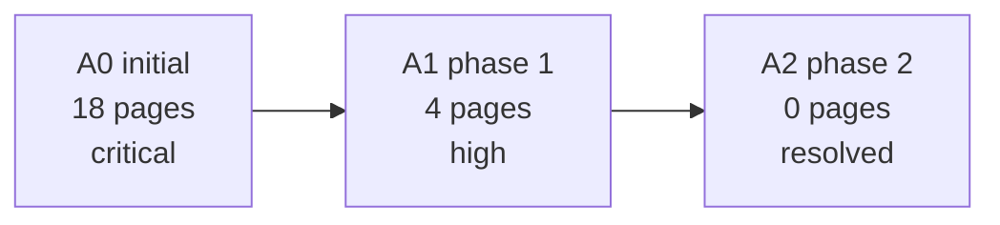

# Visual Patterns

Use these components to turn projection data into a report.

## KPI Strip

Use for all projections.

Fields:

- initial value
- current value
- total delta
- current status
- current severity

Markdown shape:

```text
[A0 18 pages] -> [A1 4 pages] -> [A2 0 pages]
Status: green | Delta: -100% | Residual: none
```

## Timeline

Use Mermaid in Markdown output.



## Evidence Heatmap

Use badges:

- `red`: missing, broken, none, poor, critical
- `orange`: partial, high, needs_improvement
- `yellow`: medium, residual, warning
- `green`: complete, good, resolved, low

Columns should be projection-specific. Keep the table narrow enough to read.

## Delta Cards

Render each `DeltaFinding` as:

```text
A0 -> A1
18 -> 4
-77.8%
Residual: major
```

## Provenance Block

Always include:

- tool name
- workspace id
- projection id
- audit run id if filtered
- generated_at if present
- evidence relation types if available

