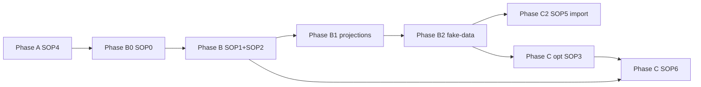

# Plan de routes — personal-mcp (SOP 0→6)

**Édition par défaut du StarterKit.** SQLite, `gcp brain ...`, MCP `ghostcrab_*`.

**Rester dans ce dossier** + `../templates/` + `../scripts/`. Pro → [../pro-mcp/ROUTE_MAP.md](../pro-mcp/ROUTE_MAP.md) via [../EDITIONS.md](../EDITIONS.md).

**Séquence canonique:** [SOP_SEQUENCE.md](SOP_SEQUENCE.md)

---

## Je suis à l'étape X → prochain fichier

| Où vous en êtes | Prochaine action | Fichier |
|-----------------|------------------|---------|
| Début | Confirmer édition Personal | [../EDITIONS.md](../EDITIONS.md) → ce dossier |
| Phase A | Bootstrap SQLite + MCP | [SOP4](SOP4_environment_bootstrap.md) |
| `ghostcrab_status` OK | Choix de voies d'import | [SOP0](SOP0_import_path_choices.md) + `../templates/import_path_choices.yaml` |
| B0 done | Modéliser workspace | [SOP1](SOP1_ghostcrab_mcp.md) + [SOP2](SOP2_obsidian_ontologie.md) |
| LinkML (SOP0) | Ontologie formelle | SOP2 §6 bis + `../templates/linkml_ontology.stub.yaml`; si multi-module/JSON : `ontology/<workspace>-contract.yaml` + `../scripts/validate_ontology_json_vs_linkml.py` |
| MCP incrémental (SOP0) | Seed unitaire | SOP2 §7 |
| Phase B — specs OK | **Préparer projections** | [§ Route projections](#route-projections) + `../scripts/README_projection_tools.md` |
| Projections validées | Matérialiser catalogue | `ghostcrab_project` + confirmation utilisateur |
| Phase B1 done | **Générer fake-data métier** | [§ Données fictives B2](#route-donnees-fictives-metier) + `../scripts/README_fake_business_data.md` |
| Fake-data prêtes | Import structured-import | [SOP5](SOP5_structured_import.md) gates 0–6 |
| Phase B done | Vault Obsidian à parser | [SOP3](SOP3_parsing_pipeline.md) |
| Corpus documents | Bulk `gcp brain document` | [SOP6](SOP6_gcp_document_import.md) |
| CSV/API/tabulaire | structured-import | [SOP5](SOP5_structured_import.md) |
| Import terminé | Audit projections + pipeline | `audit_ghostcrab_projections.py` + gate 9 |

---

## Phases



| Phase | SOP | Opérateur | Done when |
|-------|-----|-----------|-----------|
| A | SOP4 | `gcp smoke`, `gcp brain up`, `ghostcrab_status` | SQLite OK, outils MCP visibles |
| B0 | SOP0 | `import_path_choices.yaml` | choix enregistrés |
| B | SOP1 + SOP2 | MCP + LinkML ou incrémental | contrat central/gate JSON ↔ LinkML si applicable, puis `ghostcrab_coverage` baseline |
| **B1** | scripts projections | candidats + validation humaine | catalogue déclaré prêt |
| **B2** | fake-data métier | CSV `import_ready/` + manifest | gates 2–4 dry-run OK |
| C (opt.) | SOP3 | parsing vault → JSONB | validator OK |
| C | SOP6 | `gcp brain document` | pipeline document OK |
| C2 | SOP5 | `gcp brain structured-import` | facets + reindex |
| Audit | SOP5 gates 8–9 | MCP pack + `audit_ghostcrab_projections.py` | manifest + consumers |

---

## Skills (GhostCrab agent skills)

**Quelle skill invoquer à quelle phase SOP ?** → [SKILL_ROUTE_MAP.md](SKILL_ROUTE_MAP.md)

Install des 10 skills (Cursor, Claude, Codex, generic) : `gcp brain setup <ide>` depuis `ghostcrab-personal-mcp`. Matrice phase × skill × opérateur, pipeline runtime Q&A, et outils projections documentés dans ce fichier.

| Moment | Skill(s) typiques |
|--------|-------------------|
| B0 / modélisation | `ghostcrab-data-architect` |
| Convergence / audit gaps | `ghostcrab-gap-auditor` |
| B1 projections | `ghostcrab-projection-reviewer` |
| Questions métier (post-import) | `ghostcrab-operator` → `ghostcrab-evidence-discovery` → `ghostcrab-json-answer-builder` |

---

## Route projections

Les projections sont le **contrat de retrieval** agent (questions métier → scope → schémas/facettes/arêtes requis). Elles se préparent en Phase B, se matérialisent avant ou juste après l'import, et s'auditent en clôture.

**Doc outils:** [../scripts/README_projection_tools.md](../scripts/README_projection_tools.md)

### Taxonomie answer artifacts (canonique)

Route agents by **`artifact_kind`** first. Legacy Type A/B = compatibilité wire only.

| `artifact_kind` | Stockage Personal | Lecture agent |
|-----------------|-------------------|---------------|
| `analysis_plan` | table `projections` | `ghostcrab_pack`, `ghostcrab_project` |
| `live_answer_view` | `mindbrain_answer_artifacts` | `ghostcrab_live_refresh`, `gcp brain artifact refresh` |
| `answer_snapshot` | `graph_entity` (`ProjectionResult`) | `ghostcrab_projection_get` |
| `evidence_pack` | `mindbrain_answer_artifacts` | `ghostcrab_artifact_get` |

**Legacy:** Type A → `analysis_plan` · Type B → `answer_snapshot` · **`live_answer_view` n'est pas Type B**.

**`proj_type`** (`ghostcrab_project`) : `FACT` | `GOAL` | `STEP` | `CONSTRAINT` — pas `NOTE` (pack-ranking seulement).

Référence installée : `ghostcrab-shared/ARTIFACT_KINDS.md`, `ghostcrab-shared/PROJECTIONS_DISCOVERY.md` (après `gcp brain setup`). Optionnel : [renommage.md](https://github.com/mindflight-orchestrator/ghostcrab-personal-mcp/blob/main/docs/explanation/renommage.md) sur GitHub.

Un catalogue `analysis_plan` sain suffit pour démarrer ; `answer_snapshot` = rapport figé avec preuves graphe.

### Phase B1 — Préparer (avant import massif)

1. Déclarer `projection_types_allowed` dans `../templates/ontology_core_provisioning.yaml` (SOP2).
2. Extraire les candidats depuis l'ontologie / vault Markdown :

```bash
python3 ../scripts/analyze_projection_candidates.py \
  --source-dir ./specs \
  --db "$GHOSTCRAB_SQLITE_PATH" \
  --workspace <workspace_id> \
  --model-contract ../templates/mvp_core_contract.yaml \
  --write-agent-context
```

3. Revue humaine : `generated/projection_candidates/projection_model_validation.md` — valider scope, **`artifact_kind`**, `proj_type`, jobs de retrieval.
4. **Gate freeze :** pas de matérialisation sans confirmation utilisateur (aligné SOP2 Model Proposal).

Artefacts : `projection_candidates.json`, `projection_model_validation.md`, optionnel `specs/projection_catalog.yaml`.

### Matérialiser — écrire le catalogue

Par projection retenue, via MCP (unitaire) :

```json
// ghostcrab_project — analysis_plan row
{
  "scope": "<ws>:decisionnel:pilotage_hebdomadaire",
  "content": "Question métier + jobs de retrieval",
  "proj_type": "STEP",
  "status": "active",
  "agent_id": "agent:self"
}
```

Pour `live_answer_view` : charger `answer-artifacts.seed.jsonl` puis `gcp brain artifact refresh live_answer_view__<slug>`.

Pendant parsing (SOP3/SOP6), le JSONB SOP2 §4.3 peut porter un `projection_signal` — validator obligatoire avant injection.

En bulk tabulaire (SOP5 gate 7) : vérifier `ghostcrab_pack` et `ghostcrab_projection_get` sur les scopes déclarés.

### Travailler — runtime agent

| Besoin | Outil |
|--------|-------|
| Contexte opérationnel courant | `ghostcrab_pack(scope="<ws>:<scope>")` |
| Rapport figé (`answer_snapshot`) | `ghostcrab_projection_get` |
| Vue live refreshable | `gcp brain artifact refresh live_answer_view__<slug>` |
| Recherche preuves | `ghostcrab_search`, `ghostcrab_count` |
| Couverture | `ghostcrab_coverage` |

Configurer les smoke tests dans `../templates/consumer_contract.yaml` (`requires.projections: true`, check `ghostcrab_pack`).

### Auditer — post-import

```bash
python3 ../scripts/audit_ghostcrab_projections.py \
  --db "$GHOSTCRAB_SQLITE_PATH" \
  --workspace <workspace_id> \
  --model generated/<ws>/model_contract.json \
  --answer-artifacts-seed generated/<ws>/answer-artifacts.seed.jsonl
```

Rapports : `generated/projection_audits/projection_audit_<ws>.md` — gaps `analysis_plan` / `answer_snapshot` / `live_answer_view`, qualité graphe, types non enregistrés.

Puis gate 9 : `../scripts/audit_import_pipeline.mjs` + `validate_consumer_contract.mjs`.

**Answer Artifacts post-import :** charger `answer-artifacts.seed.jsonl` pour `live_answer_view` / `evidence_pack` — rafraîchir les vues (`stale` → compute via `gcp brain artifact refresh`). Voir README fake-data et `ghostcrab-shared/ARTIFACT_KINDS.md`.

---

## Route données fictives métier (Phase B2)

Génération **déterministe** de lignes métier pour valider modèle, import et projections **sans source externe** (pattern Serenity).

**Doc:** [../scripts/README_fake_business_data.md](../scripts/README_fake_business_data.md)

### Objectif

Produire des faits et arêtes **schema-valid** suffisants pour :

- passer SOP5 `structured-import validate/apply` ;
- tester les scopes projection B1 (ex. `appels_fonds_emis` avec enums `FDRO`/`FDRS`/`FDROP`, pas des valeurs génériques) ;
- alimenter `ghostcrab_search` / `ghostcrab_pack` post-import.

### Séquence B2

```text
Contrat B (model_contract.json)
  → script Python projet-local OU CSV manuels alignés mapping
  → generated/<ws>/fake_data/*.csv
  → generated/<ws>/import_ready/facets_import.csv + edges_import.csv
  → profile_source.mjs + validate_mapping + transform dry-run
  → SOP5 structured-import
  → matérialiser / rafraîchir projections B1
```

### Gates StarterKit (dry-run avant apply)

| Gate | Script |
|------|--------|
| Contrat | `export_model_contract.mjs --exported ...` |
| Profil source | `profile_source.mjs` sur `fake_data/` |
| Mapping | `validate_mapping_contract.mjs` |
| JSONB | `transform_source_to_jsonb.mjs` |

### Import Personal (C2 — enchaîne B2)

```bash
# Arrêter MCP si écriture DB directe
gcp brain structured-import validate \
  --workspace-id <ws> --model generated/<ws>/model/model_contract.json \
  --mapping ../templates/mapping_external_to_canonical.yaml \
  --input generated/<ws>/import_ready/

gcp brain structured-import register-semantics --workspace-id <ws> ...
gcp brain structured-import apply --workspace-id <ws> ...
gcp brain structured-import reindex --workspace-id <ws> --scope all
```

### Pièges (Serenity)

- **Même SQLite** que `ghostcrab_status` (`GHOSTCRAB_SQLITE_PATH`).
- **Qualité enum** — fake-data incohérentes ⇒ projections « calculables » mais métier faux.
- **Import ≠ projections** — après apply, exécuter matérialisation B1.

**Done when :** `generated/<ws>/import_manifest.yaml` rempli ; `ghostcrab_count` > 0 sur schémas core ; gate 7 projections smoke OK.

---

## Bifurcations SOP0

```yaml
edition: personal-mcp
ontology_path:
  choice: linkml          # ou mcp_incremental
tabular_path:
  choice: structured_import_cli
document_path:
  choice: gcp_document
```

| Question | Route |
|----------|-------|
| Ontologie LinkML | SOP2 §6 bis → `gcp brain ontology compile` |
| Ontologie MCP | SOP2 §7 |
| Vault Obsidian | SOP3 → SOP6 |
| Tabulaire | SOP5 |
| Documents seuls | SOP6 (LinkML si qualify) |

---

## Opérateurs autorisés

| Besoin | Surface |
|--------|---------|
| Bootstrap | `gcp authorize`, `gcp smoke`, `gcp brain up` |
| Modélisation | `ghostcrab_*` (status, workspace, schema, coverage) |
| **Projections — préparer** | `analyze_projection_candidates.py` (read-only) |
| **Projections — écrire** | `ghostcrab_project` (unitaire) |
| **Projections — lire** | `ghostcrab_pack`, `ghostcrab_projection_get` |
| **Projections — auditer** | `audit_ghostcrab_projections.py` |
| **Fake-data métier (B2)** | script Python projet + gates `profile_source` / `transform` |
| Ontologie formelle | `gcp brain ontology compile` |
| Gate JSON ontologique ↔ LinkML | `validate_ontology_json_vs_linkml.py` |
| Documents bulk | `gcp brain document` (SOP6) |
| Tabulaire bulk | `gcp brain structured-import` (SOP5) |
| Audit agent | MCP search, pack, coverage |

**Interdit:** mindCLI, COPY, `generate_copy_migrations.mjs`, `DATABASE_URL` Pro.

---

## Artefacts YAML (ordre SOP2)

1. `../templates/jtbd.yaml`
2. `../templates/mvp_core_contract.yaml`
3. `../templates/ontology_core_provisioning.yaml`
3 bis. `ontology/<workspace>-contract.yaml` si multi-module / JSON source / aliases / mappingProfile
4. `../templates/initial_referential.yaml`
5. `../templates/mapping_external_to_canonical.yaml`
6. `../templates/disambiguation.yaml`

Clôture : `../templates/import_manifest.yaml` (`edition: personal-mcp`).

---

## Checklist condensée

1. [SOP4](SOP4_environment_bootstrap.md)
2. [SOP0](SOP0_import_path_choices.md)
3. [SOP1](SOP1_ghostcrab_mcp.md) + [SOP2](SOP2_obsidian_ontologie.md)
4. **Projections :** candidats → validation → [§ Route projections](#route-projections)
5. **Fake-data métier (B2) :** [§ Données fictives](#route-donnees-fictives-metier) → `import_ready/`
6. **Import :** [SOP5](SOP5_structured_import.md) structured-import
7. Optionnel : [SOP3](SOP3_parsing_pipeline.md) → [SOP6](SOP6_gcp_document_import.md)
8. Audit : `audit_ghostcrab_projections.py` + gate 9

---

## Index SOP (ce dossier)

| SOP | Fichier | Phase |
|-----|---------|-------|
| SOP0 | [SOP0_import_path_choices.md](SOP0_import_path_choices.md) | B0 |
| SOP1 | [SOP1_ghostcrab_mcp.md](SOP1_ghostcrab_mcp.md) | B |
| SOP2 | [SOP2_obsidian_ontologie.md](SOP2_obsidian_ontologie.md) | B |
| SOP3 | [SOP3_parsing_pipeline.md](SOP3_parsing_pipeline.md) | C (opt.) |
| SOP4 | [SOP4_environment_bootstrap.md](SOP4_environment_bootstrap.md) | A |
| SOP5 | [SOP5_structured_import.md](SOP5_structured_import.md) | C2 |
| SOP6 | [SOP6_gcp_document_import.md](SOP6_gcp_document_import.md) | C |

Les stubs racine `../SOP*.md` pointent ici par défaut.
