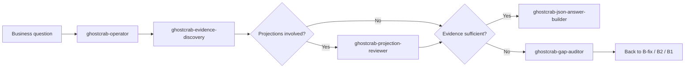

# Skill route map — personal-mcp (SOP 0→6)

**Edition:** GhostCrab Personal — SQLite, `gcp brain …`, MCP `ghostcrab_*`.

**Canon sequence:** [SOP_SEQUENCE.md](SOP_SEQUENCE.md) · **Route map:** [ROUTE_MAP.md](ROUTE_MAP.md)

This document answers: **which GhostCrab skill to invoke at which SOP phase**, alongside StarterKit scripts and MCP operators. Skills ship from the **ghostcrab-personal-mcp** product repo — not from this starter-kit.

---

## 1. Skill install (all IDEs)

Install the **10 GhostCrab skills** via `gcp brain setup` from the product package:

```bash
gcp brain setup cursor    # ~/.cursor/skills/<skill>/
gcp brain setup claude    # ~/.claude/skills/<skill>/
gcp brain setup codex     # ~/.codex/skills/<skill>/
gcp brain setup generic   # ~/.agents/skills/<skill>/
```

Opt-out: `--no-skills`. Project-local install: `--skills-scope project`.

Shared contracts install alongside skills (e.g. `ONBOARDING_CONTRACT.md`). MCP wiring per IDE: `ghostcrab-personal-mcp/ghostcrab-skills/codex/README.md` (Cursor: product `README_CURSOR_MCP.md`; Claude: `gcp-client-setup.md`).

### The 10 skills

| Skill | Category | Role |
|-------|----------|------|
| `ghostcrab-memory` | General | Durable working memory, checkpoints, long-running delivery |
| `ghostcrab-prompt-guide` | General | Fuzzy intent → next GhostCrab prompt (intake-only first turn) |
| `ghostcrab-data-architect` | General | Domain modeling, import-path choices, freeze policy |
| `ghostcrab-operator` | Operational | Business questions → deterministic MCP workflows |
| `ghostcrab-evidence-discovery` | Operational | Map questions to facets, graph, projections via MCP |
| `ghostcrab-projection-reviewer` | Operational | Review projection scope, readiness, Type A/B contracts |
| `ghostcrab-gap-auditor` | Operational | Audit answerability gaps between questions and MCP evidence |
| `ghostcrab-json-answer-builder` | Operational | Stable JSON answers (observed vs inferred vs missing) |
| `ghostcrab-integration-sop-editor` | Editorial | SOP intro rewrites (not on delivery roadmaps) |
| `mindbrain-comparison-writer` | Editorial | Comparison articles (not on delivery roadmaps) |

### Invocation rules

- **5 general skills** (`memory`, `prompt-guide`, `data-architect`, `integration-sop-editor`, `mindbrain-comparison-writer`) set `disable-model-invocation: true` — **explicitly invoke** them (`@skill` or by name).
- **5 operational skills** auto-trigger from their frontmatter `description` when the user question matches.

---

## 2. SOP phase × skill × operator matrix

| SOP phase | Primary skill(s) | Script / MCP operator | Do NOT use yet |
|-----------|------------------|----------------------|----------------|
| **A** Bootstrap | — | `gcp smoke`, `gcp brain up`, `ghostcrab_status` | `ghostcrab-gap-auditor` (no data to audit) |
| **B0** Import choices | `ghostcrab-data-architect` | [../templates/import_path_choices.yaml](../templates/import_path_choices.yaml) | `ghostcrab-json-answer-builder` |
| **B** Modeling | `ghostcrab-data-architect` | `ghostcrab_schema_register`, `gcp brain ontology compile` | `ghostcrab-projection-reviewer` |
| **B-fix** Convergence | `ghostcrab-gap-auditor` | `ghostcrab_graph_diagnostics`, project remediation scripts | `ghostcrab-projection-reviewer` |
| **B1** Prepare | `ghostcrab-data-architect`, `ghostcrab-projection-reviewer` | [../scripts/analyze_projection_candidates.py](../scripts/analyze_projection_candidates.py) | `ghostcrab_project` (before human gate) |
| **B1** Freeze | `ghostcrab-projection-reviewer` | — | any MCP write |
| **B2** Fake data | `ghostcrab-data-architect` | StarterKit gates 2–4 scripts ([SOP5](SOP5_structured_import.md)) | `ghostcrab-operator` (no business data yet) |
| **C2** Import | — | `gcp brain structured-import` validate → apply → reindex | — |
| **B1** Materialize | `ghostcrab-projection-reviewer` | `ghostcrab_project`, artifact seed/refresh | — |
| **Post-import** Refresh | — | `gcp brain artifact refresh` | — |
| **Audit** | `ghostcrab-gap-auditor` | [../scripts/audit_ghostcrab_projections.py](../scripts/audit_ghostcrab_projections.py) | — |
| **Runtime** Q&A | `ghostcrab-operator` → `ghostcrab-evidence-discovery` → `ghostcrab-json-answer-builder` | `ghostcrab_pack`, `ghostcrab_search`, `ghostcrab_projection_get` | `ghostcrab-data-architect` |
| **Runtime** Unanswerable | `ghostcrab-gap-auditor` | routes back to B-fix / B2 / B1 materialize | — |
| **Ongoing** Checkpoints | `ghostcrab-memory` | `ghostcrab_remember` at phase boundaries | — |
| **Fuzzy** intent | `ghostcrab-prompt-guide` | intake only (2–4 questions) | all MCP writes |

---

## 3. Runtime query pipeline (after C2)



---

## 4. Projection tools × skills

Companion skills for [../scripts/README_projection_tools.md](../scripts/README_projection_tools.md):

| Script moment | Companion skill |
|---------------|-----------------|
| `analyze_projection_candidates.py` (pre-import, read-only) | `ghostcrab-projection-reviewer` for human validation of `projection_model_validation.md` |
| `audit_ghostcrab_projections.py` (post-import, read-only) | `ghostcrab-gap-auditor` for remediation narrative and `adjustments[]` |
| `ghostcrab_pack` / `ghostcrab_projection_get` smoke (SOP5 gate 7) | `ghostcrab-operator` + `ghostcrab-json-answer-builder` |

---

## 5. Skills NOT on delivery roadmaps

| Skill / surface | When |
|-----------------|------|
| `ghostcrab-integration-sop-editor` | Rewriting integration SOP Markdown exports |
| `mindbrain-comparison-writer` | Drafting MindBrain comparison articles |
| SOP3 vault `.parsing/` skills | Unstructured document parsing only ([SOP3](SOP3_parsing_pipeline.md)) — unrelated to GhostCrab product skills |

---

## 6. Project-local `import_path_choices.yaml`

The StarterKit template lives at [../templates/import_path_choices.yaml](../templates/import_path_choices.yaml). For real projects, **copy or symlink a project-local file** so choices stay with the workspace:

```text
<project-root>/
  <workspace-slug>/
    import_path_choices.yaml    # e.g. serenity-p3/import_path_choices.yaml
  generated/
    import_manifest.yaml        # filled at audit (gate 9)
```

**Pattern:** one `import_path_choices.yaml` per logical workspace, co-located with ontology sources or `generated/`. Set `workspace_id` to the GhostCrab workspace slug (kebab-case). Reference the file from SOP0 prompts and `ghostcrab-memory` checkpoints.

**Example (serenity-p3):**

```yaml
edition: personal-mcp
workspace_id: serenity-p3
ontology_path:
  choice: linkml
fake_data:
  choice: generate
tabular_path:
  choice: structured_import_cli
```

Full delivery walkthrough for workspace `serenity-p3`: see project docs or the mvp-serenity `serenity-p3/` tree (ontology → convergence → B1 → B2 → C2 → agent smoke).

---

## 7. Quick reference — phase → first skill

| You are at… | Invoke first |
|-------------|--------------|
| Fuzzy / exploratory request | `ghostcrab-prompt-guide` |
| Designing ontology or import path | `ghostcrab-data-architect` |
| Graph/registry mismatch | `ghostcrab-gap-auditor` |
| Reviewing projection catalog | `ghostcrab-projection-reviewer` |
| Asking a business question (data exists) | `ghostcrab-operator` |
| Question not fully answerable | `ghostcrab-gap-auditor` |
| Need JSON/API payload from MCP | `ghostcrab-json-answer-builder` |
| Long-running multi-session work | `ghostcrab-memory` |
