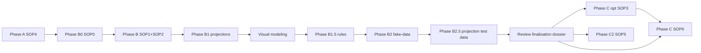

# personal-mcp — Canonical SOP sequence

**Edition:** GhostCrab Personal — `ghostcrab-personal-mcp`, SQLite, **`gcp`** + MCP **`ghostcrab_*`**.

**Route map:** [ROUTE_MAP.md](ROUTE_MAP.md)

**Skill route map:** [SKILL_ROUTE_MAP.md](SKILL_ROUTE_MAP.md) — which GhostCrab skill to invoke at each SOP phase.

**Do not use:** mindCLI, PostgreSQL COPY, `../pro-mcp/`, `generate_copy_migrations.mjs`.

**Product references (sibling clone):**

| Doc | Path |
|-----|------|
| Skill route map (this kit) | [SKILL_ROUTE_MAP.md](SKILL_ROUTE_MAP.md) |
| IDE skills install | `ghostcrab-personal-mcp/ghostcrab-skills/codex/README.md` |
| Glossary | `../ghostcrab-personal-mcp/docs/explanation/glossary.md` |
| Operator catalog | `../ghostcrab-personal-mcp/docs/reference/operator-catalog.md` |
| Ontology hub | `../ghostcrab-personal-mcp/docs/explanation/ontology/README.md` |
| MECE lab | `../ghostcrab-personal-mcp/examples/ghostcrab-docs/import_path_choices.yaml` |

---

## How to use

1. Phases **in order** (A → B0 → B → **B1** → **Visual modeling** → **B1.5** → **B2** → **B2.5** → review/finalisation → C / C2 → audit).
2. Load **only** files in this folder + `../templates/` + `../scripts/`.
3. `edition: personal-mcp` in `../templates/import_manifest.yaml`.
4. Match each phase to GhostCrab skills via [SKILL_ROUTE_MAP.md](SKILL_ROUTE_MAP.md) (`gcp brain setup cursor|claude|codex|generic` for install).

### Work spine

| Order | Phase | Required question | Done when |
|-------|-------|-------------------|-----------|
| 0 | A environment | Which runtime, DB and workspace are targeted? | `ghostcrab_status` OK; active DB/workspace identified |
| 1 | B0 import path | Which route applies: LinkML, MCP incremental, structured import, documents, API? | `import_path_choices.yaml` filled |
| 2 | B model | Which classes, facets, edges, LinkML modules, schemas and import contracts exist? | model contract + ontology path + schema activation validated |
| 3 | B1 projections | Which manager questions and proof chains must be answerable? | `artifact_kind`, `proj_type`, scopes, evidence needs reviewed |
| 4 | Visual modeling | Can humans understand the domain, process, graph and projection coverage? | `docs/visuals/domain-map.mmd`, `process-flow.mmd`, `knowledge-graph.mmd`, `projection-coverage.mmd` reference real model/projection objects |
| 5 | B1.5 rules | Which assertions, calculations, deadlines, transitions, and forbidden states consume or complete B1? | `rules/business_rules_catalog.yaml` + rule-to-projection coverage matrix |
| 6 | B2 fake-data | Which scenarios prove B1 and B1.5? | `fake_data/` + `import_ready/` cover questions and rules |
| 7 | B2.5 projection test data | Which manager snapshots, claims, evidence and assertions prove the projections? | snapshot reports + `claim -> evidence -> assertion` matrix generated |
| 8 | Review finalisation | Which strategic documents must humans validate, and in what order? | `finalisation/<workspace_id>/current/00_INDEX.md` generated |
| 9 | Import | Which Personal import path applies? | structured/document import + reindex done |
| 10 | Audit | Do MCP consumers answer from current facts/graph? | search, pack, combined search, projection_get and projection audit OK |

Do not start B2 until B1 and B1.5 have named the business questions, evidence chains, and rule assertions the data must prove.

Do not start B1.5 until the required Mermaid diagrams in `docs/visuals/` make
the domain, workflow branches, knowledge graph and projection coverage readable
for human review.

---

## Phase A — Environment

| Step | Document | Operator | Done when |
|------|----------|----------|-----------|
| A | [SOP4](SOP4_environment_bootstrap.md) | `gcp smoke`, `gcp brain up`, `ghostcrab_status` | SQLite OK, tools visible |
| — | [../EDITIONS.md](../EDITIONS.md) | read once | edition confirmed |

---

## Phase B0 — Import path choices

| Step | Document | Done when |
|------|----------|-----------|
| B0 | [SOP0](SOP0_import_path_choices.md) | `../templates/import_path_choices.yaml` filled |

---

## Phase B — Model workspace

| Step | Document | Done when |
|------|----------|-----------|
| B | [SOP1](SOP1_ghostcrab_mcp.md) | baseline `ghostcrab_coverage` |
| B | [SOP2](SOP2_obsidian_ontologie.md) | contracts + LinkML or MCP path |
| B ontology | SOP2 §6 bis + `../templates/linkml_ontology.stub.yaml` | `ontology_*` ready |

---

## Phase B1 — Projections (prepare + materialize)

| Step | Document / tool | Done when |
|------|-------------------|-----------|
| B1 prep | [ROUTE_MAP § projections](ROUTE_MAP.md#route-projections), [../scripts/README_projection_tools.md](../scripts/README_projection_tools.md) | `projection_model_validation.md` reviewed — `artifact_kind` + `proj_type` confirmed |
| B1 write | SOP2 §7.6–7.7, `ghostcrab_project` | `analysis_plan` scopes declared; optional `live_answer_view` seed |
| B1 audit (post-import) | `audit_ghostcrab_projections.py`, SOP5 gate 7 | pack + projection_get smoke OK; refresh stale `live_answer_view` if seeded |

---

## Visual modeling — Human-readable model gate

| Step | Document / tool | Done when |
|------|-------------------|-----------|
| Visual domain | `../templates/visuals/domain-map.mmd` | `docs/visuals/domain-map.mmd` shows domains, actors and JTBD |
| Visual process | `../templates/visuals/process-flow.mmd` | `docs/visuals/process-flow.mmd` shows workflow branches and blocked states |
| Visual graph | `../templates/visuals/knowledge-graph.mmd` | `docs/visuals/knowledge-graph.mmd` references real model classes and relations |
| Visual projections | `../templates/visuals/projection-coverage.mmd` | `docs/visuals/projection-coverage.mmd` maps business questions to projection ids |
| Visual audit | `validate_mindbrain_project.py` | `visual_modeling` phase is PASS |

Mermaid diagrams are validation artifacts. If humans cannot recognize the
process in these diagrams, the model is not ready for rules, fake data or import.

---

## Phase B1.5 — Business rules catalog

| Step | Document / tool | Done when |
|------|-------------------|-----------|
| B1.5 catalog | [SOP_business_rules_catalog.md](SOP_business_rules_catalog.md), `../templates/business_rules_catalog.yaml`, B1 `projection_model_validation.md` | `rules/business_rules_catalog.yaml` records assertions, scenarios, evidence chains, and projection refs |
| B1.5 coverage | rule-to-projection matrix | critical rules are covered by B1 scopes or marked as accepted model gaps |

Rules consume and complete projections: they define what fake-data must prove and what post-import audits must check.

---

## Phase B2 — Fake business data (before first bulk import)

| Step | Document / tool | Done when |
|------|-------------------|-----------|
| B2 | [ROUTE_MAP § fake-data](ROUTE_MAP.md#route-donnees-fictives-metier), [../scripts/README_fake_business_data.md](../scripts/README_fake_business_data.md) | `import_ready/` + gates 2–4 dry-run OK |
| B2 gates | `profile_source.mjs`, `validate_mapping_contract.mjs`, `transform_source_to_jsonb.mjs` | JSONL preview clean |

Skip B2 only when real tabular sources are already validated (document in `import_path_choices.yaml`).

---

## Phase B2.5 — Projection test data and snapshot evidence

| Step | Document / tool | Done when |
|------|-------------------|-----------|
| B2.5 levels | [SOP_projection_test_data_levels.md](SOP_projection_test_data_levels.md) | smoke / mini / scale profiles have explicit coverage targets |
| B2.5 snapshots | manager snapshot reports + `claim -> evidence -> assertion` matrix | active projections can be tested as manager answers, not only as imported data |
| B2.5 gate | `audit_ghostcrab_projections.py`, `ghostcrab_projection_get(..., include_evidence=true)` after import | answer snapshots are readable and auditable, or gaps are classified |

B2 validates data coverage. B2.5 validates answer coverage. Do not treat a
schema-valid import as a validated manager answer.

---

## Cross-phase — Review finalisation dossier

| Step | Document / tool | Done when |
|------|-------------------|-----------|
| review | [SOP_review_finalisation_dossier.md](SOP_review_finalisation_dossier.md) | `finalisation/<workspace_id>/current/00_INDEX.md` lists strategic documents; review rounds preserve human annotations |

Use this after new strategic artifacts are produced: business questions, rules, fake-data coverage, projection test data, snapshots, evidence matrices, import audits, or scenario comparisons.

---

## Phase C — Vault prep (optional)

| Step | Document | Done when |
|------|----------|-----------|
| C (opt.) | [SOP3](SOP3_parsing_pipeline.md) | JSONB validated, route to SOP6 chosen |

---

## Phase C — Documents

| Step | Document | Done when |
|------|----------|-----------|
| C | [SOP6](SOP6_gcp_document_import.md) | `gcp brain document` pipeline OK |

---

## Phase C2 — Tabular import

| Step | Document | Done when |
|------|----------|-----------|
| C2 | [SOP5](SOP5_structured_import.md) | structured-import + consumers |

---

## Phase audit

| Step | Document | Done when |
|------|----------|-----------|
| 9 | SOP5 + projections audit + `../templates/import_manifest.yaml` | `audit_ghostcrab_projections.py`, `audit_import_pipeline.mjs`, MCP consumers |

---

## SOP index (complete — this folder)

| SOP | File | Phase |
|-----|------|-------|
| SOP0 | [SOP0_import_path_choices.md](SOP0_import_path_choices.md) | B0 |
| SOP1 | [SOP1_ghostcrab_mcp.md](SOP1_ghostcrab_mcp.md) | B |
| SOP2 | [SOP2_obsidian_ontologie.md](SOP2_obsidian_ontologie.md) | B |
| Business rules | [SOP_business_rules_catalog.md](SOP_business_rules_catalog.md) | B1.5 |
| Projection test data | [SOP_projection_test_data_levels.md](SOP_projection_test_data_levels.md) | B2.5 |
| Review finalisation | [SOP_review_finalisation_dossier.md](SOP_review_finalisation_dossier.md) | cross-phase |
| SOP3 | [SOP3_parsing_pipeline.md](SOP3_parsing_pipeline.md) | C (opt.) |
| SOP4 | [SOP4_environment_bootstrap.md](SOP4_environment_bootstrap.md) | A |
| SOP5 | [SOP5_structured_import.md](SOP5_structured_import.md) | C2 |
| SOP6 | [SOP6_gcp_document_import.md](SOP6_gcp_document_import.md) | C |

Root `../SOP*.md` stubs default here. Pro track: [../pro-mcp/SOP_SEQUENCE.md](../pro-mcp/SOP_SEQUENCE.md).
