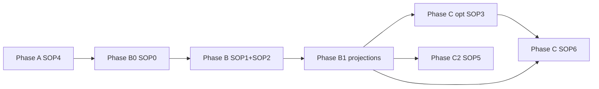

# personal-mcp — Canonical SOP sequence

**Edition:** GhostCrab Personal — `ghostcrab-personal-mcp`, SQLite, **`gcp`** + MCP **`ghostcrab_*`**.

**Route map:** [ROUTE_MAP.md](ROUTE_MAP.md)

**Do not use:** mindCLI, PostgreSQL COPY, `../pro-mcp/`, `generate_copy_migrations.mjs`.

**Product references (sibling clone):**

| Doc | Path |
|-----|------|
| Glossary | `../ghostcrab-personal-mcp/docs/explanation/glossary.md` |
| Operator catalog | `../ghostcrab-personal-mcp/docs/reference/operator-catalog.md` |
| Ontology hub | `../ghostcrab-personal-mcp/docs/explanation/ontology/README.md` |
| MECE lab | `../ghostcrab-personal-mcp/examples/ghostcrab-docs/import_path_choices.yaml` |

---

## How to use

1. Phases **in order** (A → B0 → B → **B1** → C / C2).
2. Load **only** files in this folder + `../templates/` + `../scripts/`.
3. `edition: personal-mcp` in `../templates/import_manifest.yaml`.

---

## Phase A — Environment

| Step | Document | Operator | Done when |
|------|----------|----------|-----------|
| A | [SOP4](SOP4_environment_bootstrap.md) | `gcp smoke`, `gcp brain up`, `ghostcrab_status` | SQLite OK, tools visible |
| — | [../EDITIONS.md](../EDITIONS.md) | read once | edition confirmed |

---

## Phase B0 — Import path choices

| Step | Document | Done when |
|------|----------|-----------|
| B0 | [SOP0](SOP0_import_path_choices.md) | `../templates/import_path_choices.yaml` filled |

---

## Phase B — Model workspace

| Step | Document | Done when |
|------|----------|-----------|
| B | [SOP1](SOP1_ghostcrab_mcp.md) | baseline `ghostcrab_coverage` |
| B | [SOP2](SOP2_obsidian_ontologie.md) | contracts + LinkML or MCP path |
| B ontology | SOP2 §6 bis + `../templates/linkml_ontology.stub.yaml` | `ontology_*` ready |

---

## Phase B1 — Projections (prepare + materialize)

| Step | Document / tool | Done when |
|------|-------------------|-----------|
| B1 prep | [ROUTE_MAP § projections](ROUTE_MAP.md#route-projections), [../scripts/README_projection_tools.md](../scripts/README_projection_tools.md) | `projection_model_validation.md` reviewed |
| B1 write | SOP2 §7.6–7.7, `ghostcrab_project` | catalogue Type A scopes declared |
| B1 audit (post-import) | `audit_ghostcrab_projections.py`, SOP5 gate 7 | pack + projection_get smoke OK |

---

## Phase C — Vault prep (optional)

| Step | Document | Done when |
|------|----------|-----------|
| C (opt.) | [SOP3](SOP3_parsing_pipeline.md) | JSONB validated, route to SOP6 chosen |

---

## Phase C — Documents

| Step | Document | Done when |
|------|----------|-----------|
| C | [SOP6](SOP6_gcp_document_import.md) | `gcp brain document` pipeline OK |

---

## Phase C2 — Tabular import

| Step | Document | Done when |
|------|----------|-----------|
| C2 | [SOP5](SOP5_structured_import.md) | structured-import + consumers |

---

## Phase audit

| Step | Document | Done when |
|------|----------|-----------|
| 9 | SOP5 + projections audit + `../templates/import_manifest.yaml` | `audit_ghostcrab_projections.py`, `audit_import_pipeline.mjs`, MCP consumers |

---

## SOP index (complete — this folder)

| SOP | File | Phase |
|-----|------|-------|
| SOP0 | [SOP0_import_path_choices.md](SOP0_import_path_choices.md) | B0 |
| SOP1 | [SOP1_ghostcrab_mcp.md](SOP1_ghostcrab_mcp.md) | B |
| SOP2 | [SOP2_obsidian_ontologie.md](SOP2_obsidian_ontologie.md) | B |
| SOP3 | [SOP3_parsing_pipeline.md](SOP3_parsing_pipeline.md) | C (opt.) |
| SOP4 | [SOP4_environment_bootstrap.md](SOP4_environment_bootstrap.md) | A |
| SOP5 | [SOP5_structured_import.md](SOP5_structured_import.md) | C2 |
| SOP6 | [SOP6_gcp_document_import.md](SOP6_gcp_document_import.md) | C |

Root `../SOP*.md` stubs default here. Pro track: [../pro-mcp/SOP_SEQUENCE.md](../pro-mcp/SOP_SEQUENCE.md).
