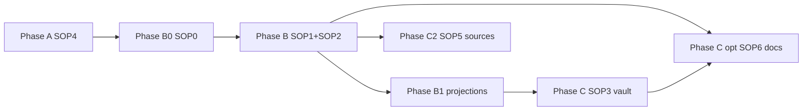

# Plan de routes — pro-mcp (SOP 0→6)

**Édition indépendante.** PostgreSQL, Docker, COPY bulk, MCP `ghostcrab_*`, **mindCLI**.

**Rester dans ce dossier** + `../templates/` + `../scripts/`. Changer de piste → [../EDITIONS.md](../EDITIONS.md).

**Séquence canonique:** [SOP_SEQUENCE.md](SOP_SEQUENCE.md)

---

## Je suis à l'étape X → prochain fichier

| Où vous en êtes | Prochaine action | Fichier |
|-----------------|------------------|---------|
| Début | Confirmer édition Pro | [../EDITIONS.md](../EDITIONS.md) → ce dossier |
| Phase A | Docker + Postgres + MCP | [SOP4](SOP4_environment_bootstrap.md) |
| `ghostcrab_status` OK | Choix de voies | [SOP0](SOP0_import_path_choices.md) + `../templates/import_path_choices.yaml` |
| B0 done | Modéliser + DDL | [SOP1](SOP1_ghostcrab_mcp.md) + [SOP2](SOP2_obsidian_ontologie.md) |
| LinkML/SQL (SOP0) | Ontologie + DDL | SOP2 §6 bis + `ghostcrab_ddl_*` |
| Phase B — specs OK | **Préparer projections** | [§ Route projections](#route-projections) + `../scripts/README_projection_tools.md` |
| Projections validées | Matérialiser + auditer pragma | `ghostcrab_project` + mindCLI `mb_pragma` |
| Phase B done | Vault Obsidian | [SOP3](SOP3_parsing_pipeline.md) → COPY |
| Corpus docs plats | COPY documents | [SOP6](SOP6_document_import.md) |
| CSV/API/CRM | Compiler sources | [SOP5](SOP5_source_import_compiler.md) |
| Import terminé | Audit projections + pipeline | mindCLI + `audit_ghostcrab_projections.py` + gate 9 |

---

## Phases



| Phase | SOP | Opérateur | Done when |
|-------|-----|-----------|-----------|
| A | SOP4 | Docker, `smoke:mcp`, `ghostcrab_status` | Postgres OK |
| B0 | SOP0 | choices YAML | voies enregistrées |
| B | SOP1 + SOP2 | MCP DDL + ontologie | inspect + coverage baseline |
| **B1** | scripts + mindCLI | candidats + catalogue pragma | `mb_pragma projections list` OK |
| C | SOP3 | parsing → COPY | coverage ≥ 80 % |
| C (opt.) | SOP6 | COPY corpus docs + mindCLI | audit pragma OK |
| C2 | SOP5 | scripts + COPY + mindCLI | consumers OK |
| Audit | gates 7–9 | mindCLI + MCP pack + audit script | manifest Pro |

---

## Route projections

Les projections décrivent **quelles questions métier** l'agent doit pouvoir traiter (scope, schémas, facettes, arêtes, jobs de retrieval). Sur Pro, **mindCLI** est la surface d'audit la plus performante ; MCP sert à la modélisation et au pack contextuel.

**Doc outils:** [../scripts/README_projection_tools.md](../scripts/README_projection_tools.md)

### Deux modes GhostCrab

| Mode | Stockage Pro | Lecture / audit |
|------|--------------|-----------------|
| **Type A — catalogue déclaré** | `mb_pragma.projections` / `mfo_projections` | mindCLI `mb_pragma projection get`, MCP `ghostcrab_pack` |
| **Type B — snapshot calculé** | `graph.entity` (`ProjectionResult`) | MCP `ghostcrab_projection_get` |

### Phase B1 — Préparer (avant COPY bulk)

1. Déclarer types et scopes dans `../templates/ontology_core_provisioning.yaml` + enums `proj_type` (SOP2 §6).
2. Extraire candidats depuis ontologie Markdown / JTBD :

```bash
python3 ../scripts/analyze_projection_candidates.py \
  --source-dir ./specs \
  --db-kind postgres \
  --postgres-dsn "$GHOSTCRAB_DSN" \
  --workspace <workspace_id> \
  --projection-catalog specs/projection_catalog.yaml \
  --model-contract artifacts/model_contract.json \
  --write-agent-context
```

3. Revue : `projection_model_validation.md` + confirmation utilisateur (gate freeze).
4. Enregistrer `projection_audit: mindcli` dans `../templates/import_path_choices.yaml`.

### Matérialiser

- **Catalogue (Type A) :** `ghostcrab_project` (MCP, unitaire) ou INSERT SQL post-COPY si batch — jamais MCP en hot-path volume.
- **Signaux parsing :** JSONB SOP2 §4.3 `projection_signal` → validé → COPY via SOP3/SOP5/SOP6.
- **DDL :** si nouveau `proj_type`, cycle `ghostcrab_ddl_propose` → approbation → `ghostcrab_ddl_execute`.

### Travailler — runtime agent

```bash
export DATABASE_URL="$GHOSTCRAB_DSN"
go run ../mindbot/cmd/mindcli --json mb_pragma projections list --workspace <ws>
go run ../mindbot/cmd/mindcli --json mb_pragma projection get --scope <ws>:<scope_slug>
go run ../mindbot/cmd/mindcli --json mb_pragma inspect --user <agent> --query "<question>" --limit 8
```

Compléter avec MCP `ghostcrab_pack(scope=...)` pour le contexte session agent.

`../templates/consumer_contract.yaml` : `requires.projections: true` + check `ghostcrab_pack`.

### Auditer — post-import (SOP5 gates 7–8, SOP6 gate 6)

```bash
python3 ../scripts/audit_ghostcrab_projections.py \
  --db-kind postgres \
  --postgres-dsn "$GHOSTCRAB_DSN" \
  --workspace <workspace_id> \
  --model artifacts/model_contract.json
```

Comparer gaps Type A (catalogue) vs Type B (`ProjectionResult`). Puis `validate_consumer_contract.mjs` et gate 9 `audit_import_pipeline.mjs`.

**Rappel SOP0 :** `projection_audit: mindcli` — ne pas se limiter à MCP pack seul pour valider le catalogue.

---

## Bifurcations SOP0

```yaml
edition: pro-mcp
ontology_path: linkml_or_sql
tabular_path: sop5_voie_a_copy
document_path: sop3_copy
projection_audit: mindcli
```

| Question | Route |
|----------|-------|
| Vault Obsidian | SOP3 → COPY |
| Documents plats | SOP6 → COPY + mindCLI |
| CSV/API | SOP5 Voie A |
| Audit projections | mindCLI `mb_pragma` (+ MCP pack) |

---

## Opérateurs autorisés

| Besoin | Surface |
|--------|---------|
| Bootstrap | Docker, `make dev-bootstrap`, `npm run smoke:mcp` |
| Modélisation | `ghostcrab_ddl_propose` → approve → `ghostcrab_ddl_execute` |
| Requête / audit MCP | `ghostcrab_search`, `ghostcrab_coverage`, `ghostcrab_pack`, `ghostcrab_projection_get` |
| **Projections — préparer** | `analyze_projection_candidates.py` |
| **Projections — écrire** | `ghostcrab_project` ou SQL (bulk COPY) |
| **Projections — auditer (perf.)** | mindCLI `mb_pragma` + `audit_ghostcrab_projections.py` |
| Bulk ingest | SQL COPY, `generate_copy_migrations.mjs`, pgx/psycopg2 |
| Dry-run gates | `../scripts/*.mjs` |

**Interdit:** `gcp brain structured-import` comme seul bulk ; MCP hot-path en volume.

**Règle MCP ≠ hot-path:** conception et audit via MCP ; écriture bulk via SQL COPY uniquement.

---

## mindCLI (audit recommandé)

```bash
export DATABASE_URL="$GHOSTCRAB_DSN"
go run ../mindbot/cmd/mindcli --json mb_pragma projections list --workspace <ws>
go run ../mindbot/cmd/mindcli --json mb_pragma projection get --scope <scope>
```

---

## Artefacts YAML

Même ordre que SOP2 Annexe A dans `../templates/`. Clôture : `import_manifest.yaml` avec `edition: pro-mcp`.

---

## Checklist condensée

1. [SOP4](SOP4_environment_bootstrap.md)
2. [SOP0](SOP0_import_path_choices.md)
3. [SOP1](SOP1_ghostcrab_mcp.md) + [SOP2](SOP2_obsidian_ontologie.md)
4. **Projections** : [§ Route projections](ROUTE_MAP.md#route-projections)
5. [SOP3](SOP3_parsing_pipeline.md) (vault) et/ou [SOP6](SOP6_document_import.md) (corpus)
6. [SOP5](SOP5_source_import_compiler.md) si sources externes
7. mindCLI + `audit_ghostcrab_projections.py` + gate 9

---

## Index SOP (ce dossier)

| SOP | Fichier | Phase |
|-----|---------|-------|
| SOP0 | [SOP0_import_path_choices.md](SOP0_import_path_choices.md) | B0 |
| SOP1 | [SOP1_ghostcrab_mcp.md](SOP1_ghostcrab_mcp.md) | B |
| SOP2 | [SOP2_obsidian_ontologie.md](SOP2_obsidian_ontologie.md) | B |
| SOP3 | [SOP3_parsing_pipeline.md](SOP3_parsing_pipeline.md) | C |
| SOP4 | [SOP4_environment_bootstrap.md](SOP4_environment_bootstrap.md) | A |
| SOP5 | [SOP5_source_import_compiler.md](SOP5_source_import_compiler.md) | C2 |
| SOP6 | [SOP6_document_import.md](SOP6_document_import.md) | C (opt.) |

Parcours Pro complet et autonome — ne pas charger `../personal-mcp/` sur une base Pro.
