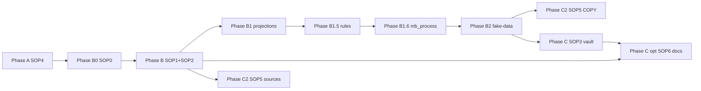

# Plan de routes — pro-mcp (SOP 0→6)

**Édition indépendante.** PostgreSQL, Docker, COPY bulk, MCP `ghostcrab_*`, **mindCLI**.

**Rester dans ce dossier** + `../templates/` + `../scripts/`. Changer de piste → [../EDITIONS.md](../EDITIONS.md).

**Séquence canonique:** [SOP_SEQUENCE.md](SOP_SEQUENCE.md)

---

## Je suis à l'étape X → prochain fichier

| Où vous en êtes | Prochaine action | Fichier |
|-----------------|------------------|---------|
| Début | Confirmer édition Pro | [../EDITIONS.md](../EDITIONS.md) → ce dossier |
| Phase A | Docker + Postgres + MCP | [SOP4](SOP4_environment_bootstrap.md) |
| `ghostcrab_status` OK | Choix de voies | [SOP0](SOP0_import_path_choices.md) + `../templates/import_path_choices.yaml` |
| B0 done | Modéliser + DDL | [SOP1](SOP1_ghostcrab_mcp.md) + [SOP2](SOP2_obsidian_ontologie.md) |
| LinkML/SQL (SOP0) | Ontologie + DDL | SOP2 §6 bis + `ghostcrab_ddl_*` |
| Phase B — specs OK | **Préparer projections** | [§ Route projections](#route-projections) + `../scripts/README_projection_tools.md` |
| Projections validées | Matérialiser + auditer pragma | `ghostcrab_project` + mindCLI `mb_pragma` |
| Phase B1 done | **Cataloguer règles métier** | [§ Règles métier B1.5](#route-regles-metier-b15) + `../templates/business_rules_catalog.yaml` |
| Phase B1.5 done | **Concevoir workflows runtime** | [§ mb_process B1.6](#route-mb_process-workflows-b16) + [SOP7](SOP7_mb_process_workflows.md) |
| Phase B1.6 done | **Générer fake-data métier** | [§ Données fictives B2](#route-donnees-fictives-metier) |
| Fake-data prêtes | Import COPY / compiler | [SOP5](SOP5_source_import_compiler.md) |
| Phase B done | Vault Obsidian | [SOP3](SOP3_parsing_pipeline.md) → COPY |
| Corpus docs plats | COPY documents | [SOP6](SOP6_document_import.md) |
| CSV/API/CRM | Compiler sources | [SOP5](SOP5_source_import_compiler.md) |
| Import terminé | Audit projections + pipeline | mindCLI + `audit_ghostcrab_projections.py` + gate 9 |

---

## Phases



| Phase | SOP | Opérateur | Done when |
|-------|-----|-----------|-----------|
| A | SOP4 | Docker, `smoke:mcp`, `ghostcrab_status` | Postgres OK |
| B0 | SOP0 | choices YAML | voies enregistrées |
| B | SOP1 + SOP2 | MCP DDL + ontologie | inspect + coverage baseline |
| **B1** | scripts + mindCLI | candidats + catalogue pragma | `mb_pragma projections list` OK |
| **B1.5** | règles métier | assertions + chaînes de preuve + projection refs | règles critiques couvertes ou gap accepté |
| **B1.6** | `mb_process` workflows | process rules + trigger provenance + outbox contract | process smoke/reconcile plan OK |
| **B2** | fake-data métier | CSV + COPY-ready migrations | dry-run gates 0–4 OK + process trigger cases if B1.6 in scope |
| C | SOP3 | parsing → COPY | coverage ≥ 80 % |
| C (opt.) | SOP6 | COPY corpus docs + mindCLI | audit pragma OK |
| C2 | SOP5 | scripts + COPY + mindCLI | consumers OK |
| Audit | gates 7–9 | mindCLI + MCP pack + audit script | manifest Pro |

---

## Route projections

Les projections décrivent **quelles questions métier** l'agent doit pouvoir traiter (scope, schémas, facettes, arêtes, jobs de retrieval). Sur Pro, **mindCLI** est la surface d'audit la plus performante ; MCP sert à la modélisation et au pack contextuel.

**Doc outils:** [../scripts/README_projection_tools.md](../scripts/README_projection_tools.md)

### Taxonomie answer artifacts (canonique)

| `artifact_kind`    | Stockage Pro                                                        | Lecture / audit                                                                                              |
| ------------------ | ------------------------------------------------------------------- | ------------------------------------------------------------------------------------------------------------ |
| `analysis_plan`    | `mb_pragma.projections`                                             | mindCLI `mb_pragma projections list`, MCP `ghostcrab_projection_decl_list` / `ghostcrab_projection_decl_get` |
| `live_answer_view` | `mb_pragma.answer_artifacts` si présent                             | MCP `ghostcrab_artifact_list artifact_kind=live_answer_view`, puis `ghostcrab_live_refresh`                  |
| `answer_snapshot`  | `mb_pragma.answer_artifacts` ou `graph.entity` (`ProjectionResult`) | MCP `ghostcrab_answer_snapshot_list`, puis `ghostcrab_projection_get`                                        |
| `evidence_pack`    | `mb_pragma.answer_artifacts` si présent                             | MCP `ghostcrab_artifact_list artifact_kind=evidence_pack`, puis `ghostcrab_artifact_get`                     |

**Legacy:** Type A → `analysis_plan` · Type B → `answer_snapshot`.
Ne plus exposer Type A / Type B aux utilisateurs finaux ; conserver ces noms
uniquement comme vocabulaire de compatibilité technique.

### Mapping intentions métier → surfaces MCP

| Intention utilisateur / agent | Surface recommandée |
|-------------------------------|---------------------|
| "liste les plans disponibles" | `ghostcrab_projection_decl_list` |
| "ouvre ce plan" | `ghostcrab_projection_decl_get` |
| "liste les live views" | `ghostcrab_artifact_list` avec `artifact_kind=live_answer_view` |
| "rafraîchis cette vue live" | `ghostcrab_live_refresh` |
| "liste les snapshots disponibles" | `ghostcrab_answer_snapshot_list` |
| "ouvre ce snapshot précis" | `ghostcrab_projection_get` |
| "liste les paquets de preuves" | `ghostcrab_artifact_list` avec `artifact_kind=evidence_pack` |
| "ouvre ce paquet de preuves" | `ghostcrab_artifact_get` |

### Phase B1 — Préparer (avant COPY bulk)

1. Déclarer types et scopes dans `../templates/ontology_core_provisioning.yaml` + enums `proj_type` (SOP2 §6).
2. Extraire candidats depuis ontologie Markdown / JTBD :

```bash
python3 ../scripts/analyze_projection_candidates.py \
  --source-dir ./specs \
  --db-kind postgres \
  --postgres-dsn "$GHOSTCRAB_DSN" \
  --workspace <workspace_id> \
  --projection-catalog specs/projection_catalog.yaml \
  --manager-questions specs/manager_questions.yaml \
  --projection-requirements specs/projection_requirements.yaml \
  --expand-manager-question-clusters \
  --model-contract artifacts/model_contract.json \
  --write-agent-context
```

3. Revue : `projection_model_validation.md` — confirmer **`artifact_kind`** + `proj_type` + confirmation utilisateur (gate freeze).
   - `manager_questions` = vues stratégiques possibles, parfois larges.
   - `manager_question_cluster` = déclinaisons naïves/focalisées par groupes de facettes/arêtes.
   - Ne pas importer automatiquement tous les clusters : promouvoir seulement ceux qui correspondent à une vraie question opérateur ou agent.
4. Enregistrer `projection_audit: mindcli` dans `../templates/import_path_choices.yaml`.

### Matérialiser

- **Catalogue (`analysis_plan`) :** `ghostcrab_project` (MCP, unitaire) ou INSERT SQL post-COPY si batch — jamais MCP en hot-path volume.
- **Signaux parsing :** JSONB SOP2 §4.3 `projection_signal` → validé → COPY via SOP3/SOP5/SOP6.
- **DDL :** si nouveau `proj_type`, cycle `ghostcrab_ddl_propose` → approbation → `ghostcrab_ddl_execute`.

### Travailler — runtime agent

```bash
export DATABASE_URL="$GHOSTCRAB_DSN"
go run ../mindbot/cmd/mindcli --json mb_pragma projections list --workspace <ws>
go run ../mindbot/cmd/mindcli --json mb_pragma projection get --scope <ws>:<scope_slug>
go run ../mindbot/cmd/mindcli --json mb_pragma inspect --user <agent> --query "<question>" --limit 8
```

Compléter avec MCP `ghostcrab_pack(scope=...)` pour le contexte session agent.
Pour l'inventaire MCP direct, utiliser `ghostcrab_projection_decl_list`,
`ghostcrab_artifact_list` et `ghostcrab_answer_snapshot_list` avant les appels
de lecture ciblés.

`../templates/consumer_contract.yaml` : `requires.projections: true` + check `ghostcrab_pack`.

### Auditer — post-import (SOP5 gates 7–8, SOP6 gate 6)

```bash
python3 ../scripts/audit_ghostcrab_projections.py \
  --db-kind postgres \
  --postgres-dsn "$GHOSTCRAB_DSN" \
  --workspace <workspace_id> \
  --model artifacts/model_contract.json
```

Comparer gaps `analysis_plan` (catalogue) vs `answer_snapshot` (`ProjectionResult`). Puis `validate_consumer_contract.mjs` et gate 9 `audit_import_pipeline.mjs`.

**Rappel SOP0 :** `projection_audit: mindcli` — ne pas se limiter à MCP pack seul pour valider le catalogue.

---

## Route règles métier B1.5

Les règles métier sont le pont entre les projections B1 et les données B2 : elles disent ce qui doit être vrai, calculé, interdit, déclenché, justifié ou expliqué.

**Template:** [../templates/business_rules_catalog.yaml](../templates/business_rules_catalog.yaml)

### Séquence

```text
projection_model_validation.md
  → rules/business_rules_catalog.yaml
  → matrice règles ↔ projections
  → fake-data scenarios / assertions
  → COPY / import
  → mindCLI + MCP post-import audit
```

### Done when

- chaque règle critique a au moins une assertion testable ;
- chaque règle critique pointe vers une projection B1 ou un `model_gap` accepté ;
- les chaînes de preuve listent objets, facettes, arêtes et artifact_kind attendus ;
- B2 sait quels scénarios smoke / mini / scale générer.

---

## Route mb_process workflows B1.6

`mb_process` est la couche Pro qui transforme certaines règles actionnables en
processus runtime auditable. Le passage est:

```text
projection validee
  -> business rule / actionable state
  -> mb_process.process_rule
  -> event_type
  -> process_trigger provenance
  -> events_outbox
  -> consumer / workflow step
```

**SOP:** [SOP7_mb_process_workflows.md](SOP7_mb_process_workflows.md)

### Done when

- chaque workflow part d'une projection ou règle B1/B1.5 validée ;
- l'action attendue, le propriétaire humain/agent et le stop condition sont explicites ;
- le `provenance_kind` est choisi (`graph_rule_state`, `entity_exists`, `process_rule_enabled`, etc.) ;
- l'idempotency key et la stratégie de réactivation sont définies ;
- l'outbox event a un consommateur ou une raison d'être claire ;
- le mode de firing est explicite: manuel, planifié, event/rule-state ; managed dispatch reste expérimental.

### Audit

Utiliser les surfaces MCP Pro quand elles existent:

- `ghostcrab_process_rules_import`
- `ghostcrab_process_rules_list`
- `ghostcrab_process_rules_evaluate`
- `ghostcrab_process_triggers_register`
- `ghostcrab_process_triggers_list`
- `ghostcrab_process_triggers_reconcile`
- `ghostcrab_process_triggers_fire`

Ne pas confondre trigger descriptif dans `business_rules_catalog.yaml` et
trigger runtime `mb_process`. Le premier explique et teste. Le second peut
émettre un événement durable dans `mb_process.events_outbox`.

---

## Route données fictives métier (Phase B2)

Même objectif que Personal : valider modèle + graphe + projections **sans CRM/API réel**.

**Doc:** [../scripts/README_fake_business_data.md](../scripts/README_fake_business_data.md)

### Séquence B2 (Pro)

```text
model_contract.json
  → fake_data/*.csv + import_ready/
  → scenarios for B1 answers, B1.5 assertions, and B1.6 trigger provenance
  → profile_source.mjs + validate_mapping + transform_source_to_jsonb
  → generate_copy_migrations.mjs (ou plan import_facets.mjs)
  → COPY PostgreSQL (hot-path SQL — pas MCP bulk)
  → mindCLI mb_pragma + ghostcrab_coverage
  → matérialiser projections B1
  → smoke `mb_process` rules/triggers if B1.6 is in scope
```

### Sorties

- `generated/<ws>/fake_data/` — CSV par type métier  
- `generated/<ws>/import_ready/` — fichiers COPY `mfo_facets` / `graph.relation`  
- `import_manifest.json` — counts + `edition: pro-mcp`

### Règles

- Enums et `schema_id` stricts (éviter données « annuel » hors modèle).  
- Volume suffisant pour smoke des scopes B1 retenus.  
- **`DATABASE_URL`** identique entre COPY, MCP et mindCLI.

**Done when :** COPY appliqué ; coverage ≥ 80 % ; audit projections sans gap bloquant sur scopes core.

---

## Bifurcations SOP0

```yaml
edition: pro-mcp
ontology_path: linkml_or_sql
tabular_path: sop5_voie_a_copy
document_path: sop3_copy
projection_audit: mindcli
```

| Question | Route |
|----------|-------|
| Vault Obsidian | SOP3 → COPY |
| Documents plats | SOP6 → COPY + mindCLI |
| CSV/API | SOP5 Voie A |
| Audit projections | mindCLI `mb_pragma` (+ MCP pack) |

---

## Opérateurs autorisés

| Besoin | Surface |
|--------|---------|
| Bootstrap | Docker, `make dev-bootstrap`, `npm run smoke:mcp` |
| Modélisation | `ghostcrab_ddl_propose` → approve → `ghostcrab_ddl_execute` |
| Requête / audit MCP | `ghostcrab_search`, `ghostcrab_coverage`, `ghostcrab_pack`, `ghostcrab_projection_decl_list`, `ghostcrab_artifact_list`, `ghostcrab_answer_snapshot_list`, `ghostcrab_projection_get` |
| **Projections — préparer** | `analyze_projection_candidates.py` |
| **Projections — écrire** | `ghostcrab_project` ou SQL (bulk COPY) |
| **Projections — auditer (perf.)** | mindCLI `mb_pragma` + `audit_ghostcrab_projections.py` |
| **Process workflows — concevoir** | [SOP7_mb_process_workflows.md](SOP7_mb_process_workflows.md), `ghostcrab_process_*` |
| **Fake-data métier (B2)** | gates StarterKit + COPY / `generate_copy_migrations.mjs` |
| Bulk ingest | SQL COPY, `generate_copy_migrations.mjs`, pgx/psycopg2 |
| Dry-run gates | `../scripts/*.mjs` |

**Interdit:** `gcp brain structured-import` comme seul bulk ; MCP hot-path en volume.

**Règle MCP ≠ hot-path:** conception et audit via MCP ; écriture bulk via SQL COPY uniquement.

---

## mindCLI (audit recommandé)

```bash
export DATABASE_URL="$GHOSTCRAB_DSN"
go run ../mindbot/cmd/mindcli --json mb_pragma projections list --workspace <ws>
go run ../mindbot/cmd/mindcli --json mb_pragma projection get --scope <scope>
```

---

## Artefacts YAML

Même ordre que SOP2 Annexe A dans `../templates/`. Clôture : `import_manifest.yaml` avec `edition: pro-mcp`.

---

## Checklist condensée

1. [SOP4](SOP4_environment_bootstrap.md)
2. [SOP0](SOP0_import_path_choices.md)
3. [SOP1](SOP1_ghostcrab_mcp.md) + [SOP2](SOP2_obsidian_ontologie.md)
4. **Projections** : [§ Route projections](ROUTE_MAP.md#route-projections)
5. **Règles métier (B1.5)** : [§ Règles métier](ROUTE_MAP.md#route-regles-metier-b15)
6. **Workflows runtime (B1.6)** : [§ mb_process](ROUTE_MAP.md#route-mb_process-workflows-b16)
7. **Fake-data (B2)** : [§ Données fictives](ROUTE_MAP.md#route-donnees-fictives-metier)
8. [SOP5](SOP5_source_import_compiler.md) — COPY + mindCLI
9. [SOP3](SOP3_parsing_pipeline.md) / [SOP6](SOP6_document_import.md) si corpus doc
10. Audit : `audit_ghostcrab_projections.py` + gate 9 + process runtime audit if B1.6 is in scope

---

## Index SOP (ce dossier)

| SOP | Fichier | Phase |
|-----|---------|-------|
| SOP0 | [SOP0_import_path_choices.md](SOP0_import_path_choices.md) | B0 |
| SOP1 | [SOP1_ghostcrab_mcp.md](SOP1_ghostcrab_mcp.md) | B |
| SOP2 | [SOP2_obsidian_ontologie.md](SOP2_obsidian_ontologie.md) | B |
| SOP3 | [SOP3_parsing_pipeline.md](SOP3_parsing_pipeline.md) | C |
| SOP4 | [SOP4_environment_bootstrap.md](SOP4_environment_bootstrap.md) | A |
| SOP5 | [SOP5_source_import_compiler.md](SOP5_source_import_compiler.md) | C2 |
| SOP6 | [SOP6_document_import.md](SOP6_document_import.md) | C (opt.) |
| SOP7 | [SOP7_mb_process_workflows.md](SOP7_mb_process_workflows.md) | B1.6 |

Parcours Pro complet et autonome — ne pas charger `../personal-mcp/` sur une base Pro.
