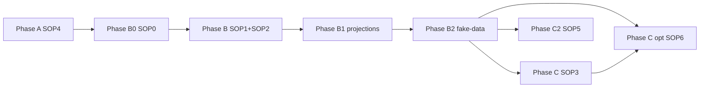

# pro-mcp — Canonical SOP sequence

**Edition:** GhostCrab Pro — `ghostcrab-mcp`, PostgreSQL, Docker, **`DATABASE_URL`**, MCP, **mindCLI from `../mindbot/cmd/mindcli`**.

**Route map:** [ROUTE_MAP.md](ROUTE_MAP.md)

**Do not use:** `gcp brain structured-import` as primary bulk path.

Pour changer de piste : [../EDITIONS.md](../EDITIONS.md).

---

## How to use

1. Phases **in order** (A → B0 → B → **B1** → **B2** → C / C2).
2. Load **only** files in this folder + `../templates/` + `../scripts/`.
3. `edition: pro-mcp` in `../templates/import_manifest.yaml`.



---

## Phase A — Environment

| Step | Document | Operator | Done when |
|------|----------|----------|-----------|
| A | [SOP4](SOP4_environment_bootstrap.md) | Docker, `make dev-bootstrap`, `smoke:mcp` | `ghostcrab_status` OK |

---

## Phase B0 — Import path choices

| Step | Document | Done when |
|------|----------|-----------|
| B0 | [SOP0](SOP0_import_path_choices.md) | choices YAML recorded |

---

## Phase B — Model workspace

| Step | Document | Done when |
|------|----------|-----------|
| B | [SOP1](SOP1_ghostcrab_mcp.md) | DDL + inspect OK |
| B | [SOP2](SOP2_obsidian_ontologie.md) | schemas approved |

---

## Phase B1 — Projections (prepare + materialize + audit)

| Step | Document / tool | Done when |
|------|-------------------|-----------|
| B1 prep | [ROUTE_MAP § projections](ROUTE_MAP.md#route-projections), [../scripts/README_projection_tools.md](../scripts/README_projection_tools.md) | candidates + user validation — `artifact_kind` confirmed |
| B1 write | SOP2 §7.6–7.7, `ghostcrab_project` or SQL post-COPY | `analysis_plan` catalogue populated |
| B1 audit | mindCLI `mb_pragma`, MCP `ghostcrab_projection_decl_list` / `ghostcrab_artifact_list` / `ghostcrab_answer_snapshot_list`, `audit_ghostcrab_projections.py` | gaps `analysis_plan` / `answer_snapshot` reviewed |

---

## Phase B2 — Fake business data

| Step | Document / tool | Done when |
|------|-------------------|-----------|
| B2 | [ROUTE_MAP § fake-data](ROUTE_MAP.md#route-donnees-fictives-metier), [../scripts/README_fake_business_data.md](../scripts/README_fake_business_data.md) | `import_ready/` + COPY migrations planned |
| B2 gates | StarterKit dry-run scripts | mapping + transform OK before COPY |

---

## Phase C — Vault COPY

| Step | Document | Done when |
|------|----------|-----------|
| C | [SOP3](SOP3_parsing_pipeline.md) | COPY + coverage ≥ 80 % |

---

## Phase C — Document corpus (optional)

| Step | Document | Done when |
|------|----------|-----------|
| C (opt.) | [SOP6](SOP6_document_import.md) | COPY docs + mindCLI audit OK |

---

## Phase C2 — External sources

| Step | Document | Done when |
|------|----------|-----------|
| C2 | [SOP5](SOP5_source_import_compiler.md) | scripts + mindCLI audit |

### mindCLI (Pro)

```bash
export DATABASE_URL="$GHOSTCRAB_DSN"
go run ../mindbot/cmd/mindcli --json mb_pragma projections list --workspace <ws>
go run ../mindbot/cmd/mindcli --json mb_pragma projection get --scope <scope>
```

MCP inventory equivalents: `ghostcrab_projection_decl_list` for
`analysis_plan`, `ghostcrab_artifact_list` for `live_answer_view` and
`evidence_pack`, `ghostcrab_answer_snapshot_list` for `answer_snapshot`.

See `../../docs/3.modules/3.2.mindbrain-mindcli.md`.

---

## SOP index (complete — this folder)

| SOP | File | Phase |
|-----|------|-------|
| SOP0 | [SOP0_import_path_choices.md](SOP0_import_path_choices.md) | B0 |
| SOP1 | [SOP1_ghostcrab_mcp.md](SOP1_ghostcrab_mcp.md) | B |
| SOP2 | [SOP2_obsidian_ontologie.md](SOP2_obsidian_ontologie.md) | B |
| SOP3 | [SOP3_parsing_pipeline.md](SOP3_parsing_pipeline.md) | C |
| SOP4 | [SOP4_environment_bootstrap.md](SOP4_environment_bootstrap.md) | A |
| SOP5 | [SOP5_source_import_compiler.md](SOP5_source_import_compiler.md) | C2 |
| SOP6 | [SOP6_document_import.md](SOP6_document_import.md) | C (opt.) |

Parcours Pro autonome — [ROUTE_MAP.md](ROUTE_MAP.md).
